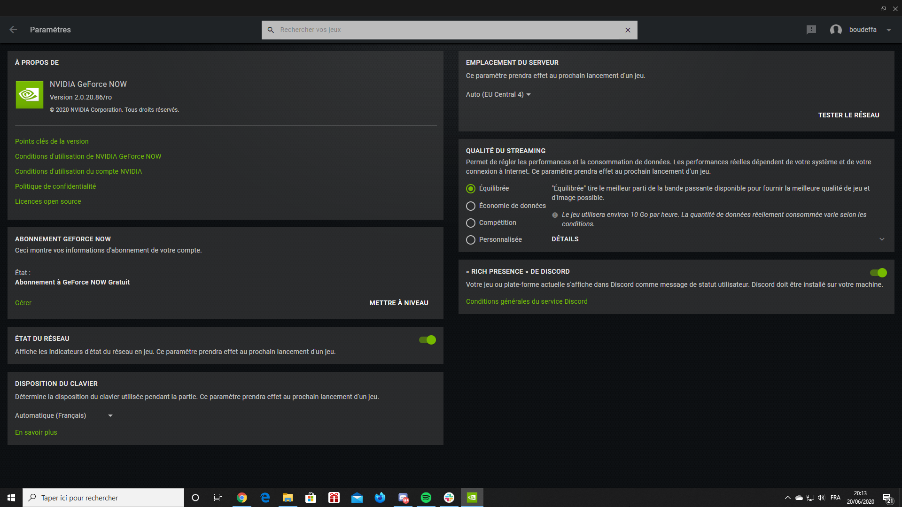

# How to troubleshoot your GFN client

Let's start with the main screen that concern the troubleshooting, it's the settings screen

Genrally speaking, the problem is YOUR CONNEXION

So, a general troobleshooting is to start by checking the hardware

1. Restart your router (turn it off then wait 10 sec before restarting)
2. Resintall your GFN client
3. Reboot your computer
